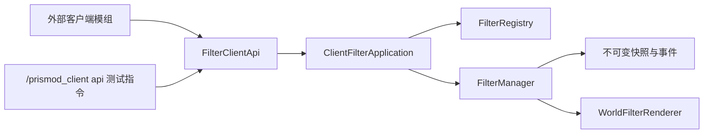
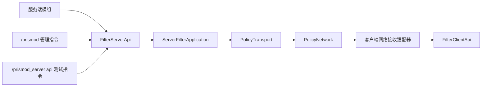

# Prismod API、指令与网络架构审查稿

本文档用于审查 Prismod 当前的 API、指令、抽象层和网络层。它以源码现状为事实来源，区分已经实现的调用链、必须保持的边界和需要在后续审查中确认的架构决策。

适用版本：Minecraft 1.20.1、Forge 47.3.32、Java 17。

## 1. 审查范围和目标

本次审查覆盖：

- 客户端公开 API；
- 服务端公开 API；
- 服务端管理指令；
- 客户端 API 测试指令；
- 服务端 API 测试指令；
- 客户端和服务端的应用/抽象层；
- `prismod:policy` 冻结网络层；
- 客户端网络接收适配器；
- 客户端、服务端和网络之间的依赖方向。

审查目标不是增加另一套兼容 API，而是确认所有入口都通过统一的契约和用例层完成调用，避免指令或网络实现直接修改内部状态。

## 2. 当前实现分层

### 2.1 客户端调用链



实际职责如下：

| 层 | 当前实现 | 允许承担的职责 |
| --- | --- | --- |
| 公开 API | `api/client/FilterClientApi` | 提供稳定方法、请求入口和公开返回类型 |
| 客户端应用层 | `client/application/ClientFilterApplication` | 参数检查、owner 归一化、客户端线程调度、状态操作和操作结果发布 |
| 注册表适配器 | `client/filter/registry/FilterRegistry` | 发现、注册、注销和描述滤镜 |
| 状态适配器 | `client/filter/state/FilterManager` | 选择、强制状态、覆盖、订阅和渲染可用性 |
| 渲染适配器 | `client/render/WorldFilterRenderer` | 消费内部状态并执行世界画面后处理 |
| 测试入口 | `command/test/client/PrismodClientApiCommands` | 模拟外部模组调用公开 API，并显示测试结果 |

外部模组不应引用 `ClientFilterApplication`、`FilterRegistry`、`FilterManager` 或渲染类。客户端测试指令也不应绕过 `FilterClientApi`。

### 2.2 服务端调用链



实际职责如下：

| 层 | 当前实现 | 允许承担的职责 |
| --- | --- | --- |
| 服务端公开 API | `api/server/FilterServerApi` | 暴露服务端查询、选择、覆盖和清理操作 |
| 服务端应用层 | `server/application/ServerFilterApplication` | 校验请求、保存策略、递增 generation、调用网络端口、登录补发 |
| 管理指令适配器 | `command/server/PrismodServerCommands` | 解析 Brigadier 参数、创建公共请求、转换 i18n 反馈 |
| 测试指令适配器 | `command/test/server/PrismodServerApiCommands` | 通过公开服务端 API 执行逐步测试 |
| 网络抽象端口 | `network/contract/PolicyTransport` | 暴露广播和指定玩家发送能力 |
| Forge 网络实现 | `network/transport/PolicyNetwork` | 创建通道、编解码、路由和客户端 sink 分发 |
| 客户端接收适配器 | `client/network/PrismodClientNetwork` | 把策略消息翻译为客户端 API 调用，并维护网络覆盖句柄 |

服务端命令不得直接调用 `ServerFilterApplication` 的状态表；服务端应用层不得直接依赖 `SimpleChannel`、`PacketDistributor` 或编解码细节。

## 3. 抽象层设计

### 3.1 抽象层的边界

```text
外部调用者
    -> 公开 API 契约
    -> 请求归一化和用例层
    -> 平台/状态/渲染/网络适配器
    -> 外部系统
```

抽象层的作用是固定上层看到的输入、输出和生命周期，不让上层感知后端存储、Forge 网络类型或客户端渲染实现。

### 3.2 客户端抽象契约

客户端公开契约包括：

- `FilterSnapshot`：不可变最终状态和用户选择状态；
- `FilterDescriptor`：滤镜身份、类型、owner、可用性和失败原因；
- `FilterRegistration`：自定义滤镜注册句柄；
- `FilterOverride`：覆盖句柄；
- `FilterSubscription`：订阅生命周期句柄；
- `FilterOperation`：异步或线程调度操作的状态；
- `FilterEvent`：快照、注册表、可用性和操作完成事件；
- `CustomFilterMetadata`：显示翻译键和默认强度。

这些类型只能表达稳定业务状态，不能暴露 `FilterManager`、`FilterRegistry`、`PostChain`、OpenGL 对象或 Forge 网络对象。

### 3.3 服务端抽象契约

服务端公开契约包括：

- `FilterSelectionRequest`：逻辑滤镜 ID 和强度；
- `FilterOverrideRequest`：owner、逻辑滤镜 ID、强度和 priority；
- `OperationResult`：状态、反馈代码、请求 ID、目标、影响数量、参数和 generation；
- `ServerStatus`：初始化状态、网络通道和协议版本；
- `ServerFilterStatus`：服务端策略计数和全局选择摘要。

服务端结果不包含自然语言。命令适配器根据 `status` 和 `code` 选择翻译键，API 调用方根据结构化字段处理业务。

### 3.4 抽象层的统一入口规则

| 调用来源 | 正确入口 | 禁止路径 |
| --- | --- | --- |
| 客户端外部模组 | `FilterClientApi` | 直接操作 `FilterManager` 或 `FilterRegistry` |
| 客户端测试指令 | `FilterClientApi` | 直接构造内部覆盖或修改配置 |
| 服务端外部模组 | `FilterServerApi` | 直接操作 `ServerFilterApplication` 状态表 |
| 服务端管理指令 | `FilterServerApi` | 指令中重复实现业务规则 |
| 服务端 API 测试指令 | `FilterServerApi` | 直接调用网络或策略状态 |
| 服务端用例层 | `PolicyTransport` | 直接使用 `SimpleChannel` 或 `PacketDistributor` |
| 客户端网络接收 | `FilterClientApi` | 直接调用 `FilterManager` |

## 4. API 与指令架构

### 4.1 客户端 API

公开入口为 `com.xkmxz.prismod.api.client.FilterClientApi`，当前操作分为：

- 注册：`registerCustomFilter`、`clearRegistrations`；
- 选择：`setSessionSelection`、`clearSessionSelection`；
- 强制：`setForcedFilter`、`clearForcedFilter`；
- 覆盖：`createOverride`、`clearOverrides`；
- 查询：`snapshot`、`filters`、`availableFilters`；
- 监听：`subscribe`、`subscribeEvents`。

写操作由 `ClientFilterApplication` 统一调度到客户端线程。句柄通过 `close()` 结束生命周期，快照和描述通过不可变 record 返回。

### 4.2 服务端 API

公开入口为 `com.xkmxz.prismod.api.server.FilterServerApi`，当前操作分为：

- 查询：`status`、`filterStatus`；
- 全局选择：`broadcastSelection`；
- 玩家选择：`sendSelection`；
- 全局覆盖：`broadcastOverride`；
- 玩家覆盖：`sendOverride`；
- 全局覆盖清理：`clearBroadcastOverride`；
- 玩家覆盖清理：`clearPlayerOverride`；
- 批量清理：`clearAllOverrides`、`clearSelection`。

所有变更最终进入 `ServerFilterApplication`，由该层统一完成状态变更、generation 递增和策略消息发送。

### 4.3 服务端管理指令

```text
/prismod help
/prismod status
/prismod filter select broadcast <id> [strength]
/prismod filter select player <target> <id> [strength]
/prismod filter override broadcast <owner> <id> <priority> [strength]
/prismod filter override player <target> <owner> <id> <priority> [strength]
/prismod filter clear selection
/prismod filter clear broadcast <owner>
/prismod filter clear player <target> <owner>
/prismod filter clear all
```

`filter` 管理分支要求 OP 权限等级 2。命令代码只负责 Brigadier 参数解析、公共请求创建、调用 API 和 i18n 输出。命令反馈必须使用 `Component.translatable(...)`，不得把自然语言写入 Java。

### 4.4 API 测试指令

客户端测试指令：

```text
/prismod_client api help
/prismod_client api list
/prismod_client api snapshot
/prismod_client api force <filter> [strength]
/prismod_client api clear
/prismod_client api watch
/prismod_client api watch_events
/prismod_client api owner_clear
```

固定 owner 为 `prismod-api-test-mod`，用于验证注册、快照、覆盖、清理和事件发布。

服务端测试指令：

```text
/prismod_server api help
/prismod_server api status
/prismod_server api select broadcast <filter> [strength]
/prismod_server api select player <target> <filter> [strength]
/prismod_server api override broadcast <filter> <priority> [strength]
/prismod_server api override player <target> <filter> <priority> [strength]
/prismod_server api clear selection
/prismod_server api clear owner
/prismod_server api clear all
/prismod_server api reset
```

固定 owner 为 `prismod-server-api-test`，要求 OP 权限等级 2。测试指令只能通过 `FilterServerApi` 验证服务端请求、状态和结果，实际画面由测试人员在客户端观察。

## 5. 网络层架构

### 5.1 冻结契约

| 项目 | 当前固定值 |
| --- | --- |
| 通道 | `prismod:policy` |
| 协议版本 | `1` |
| 抽象端口 | `PolicyTransport` |
| Forge 实现 | `PolicyNetwork` |
| 消息类型 | `PolicyMessage` |
| 编解码 | `FriendlyByteBuf`，仅存在于网络实现边界 |

`PolicyTransport` 当前提供三个能力：

```java
void registerClientSink(Consumer<PolicyMessage> sink);
void broadcast(PolicyMessage message);
void send(ServerPlayer player, PolicyMessage message);
```

业务层只能依赖这个端口；`SimpleChannel`、`PacketDistributor`、`NetworkEvent.Context` 和 packet wrapper 不应向上泄漏。

### 5.2 PolicyMessage 字段

```text
operation   = SELECT | OVERRIDE | CLEAR_SELECTION | CLEAR_OVERRIDE | CLEAR_ALL_OVERRIDES
requestId   = UUID
owner       = String
filter      = ResourceLocation，可为空
strength    = float，规范化到 0.0 到 1.0
priority    = int
```

广播和指定玩家不是消息字段，而是发送端口的目标：

```text
ServerFilterApplication
    -> PolicyTransport.broadcast(message)
    -> 所有客户端

ServerFilterApplication
    -> PolicyTransport.send(player, message)
    -> 指定客户端
```

### 5.3 操作映射

| 网络操作 | 客户端接收行为 |
| --- | --- |
| `SELECT` | 调用 `FilterClientApi.setSessionSelection` |
| `OVERRIDE` | 调用 `FilterClientApi.createOverride` |
| `CLEAR_SELECTION` | 调用 `FilterClientApi.clearSessionSelection` |
| `CLEAR_OVERRIDE` | 关闭对应 request ID 的 `FilterOverride` 句柄 |
| `CLEAR_ALL_OVERRIDES` | 关闭并清空全部网络覆盖句柄 |

客户端网络适配器以 request ID 做覆盖幂等键。重复 `OVERRIDE` request ID 会被忽略；退出世界时会关闭网络创建的覆盖并清除会话选择。

### 5.4 登录补发

玩家登录时，服务端应用层向该玩家补发：

1. 当前全局选择；
2. 当前全局覆盖；
3. 该玩家的个人选择；
4. 该玩家的个人覆盖。

网络层不提供服务端状态查询、通用 RPC 或操作回执。`OperationResult` 是服务端本地用例结果，不是客户端确认消息。

## 6. 依赖方向审查

### 6.1 允许的方向

```text
api/common  <- api/client / api/server
api/client  <- ClientFilterApplication / 客户端命令
api/server  <- ServerFilterApplication / 服务端命令
network/contract <- ServerFilterApplication / PolicyNetwork / 客户端接收适配器
network/transport -> Forge 网络实现
```

平台实现可以依赖公共契约，公共契约不能反向依赖客户端渲染或 Forge 网络实现。

### 6.2 必须阻止的依赖

- `api/common`、`api/server`、服务端应用层不得引用 `net.minecraft.client`；
- 服务端命令不得引用 `FilterManager`、`FilterRegistry` 或渲染类；
- 服务端应用层不得引用 `SimpleChannel`、`PacketDistributor` 或 packet wrapper；
- 客户端 API 不得把 `FilterManager`、`FilterRegistry` 或 `WorldFilterRenderer` 作为公开返回类型；
- 网络消息不得携带客户端渲染对象、GUI 对象或服务端状态表；
- 业务结果不得携带自然语言 detail 来代替稳定反馈代码；
- 命令 Java 代码不得使用 `Component.literal` 生成用户反馈。

## 7. 架构审查清单

### 已满足的检查项

- API 和命令共用服务端应用层；
- 客户端 API 写操作集中在客户端应用层调度；
- 服务端业务通过 `PolicyTransport` 发送策略；
- 网络通道和协议版本固定；
- 客户端网络消息转换回客户端 API；
- API 测试命令不直接修改内部状态；
- 命令反馈使用 i18n 翻译键；
- 网络消息字段和操作集合固定；
- 服务端登录补发和客户端重复消息幂等已有实现路径。

### 当前需要重点确认的审查项

以下项目是当前源码层面的架构审查问题，不代表已经批准的改动：

1. `PolicyTransport.registerClientSink(...)` 同时出现在服务端业务端口和客户端接收注册中。需要决定是否继续保留这一共享接口，还是拆成服务端发送端口与客户端接收端口，进一步收窄依赖方向。
2. `FilterServerApi` 当前从 `PolicyTransport` 读取通道和协议常量。需要确认公开 API 是否允许直接依赖网络契约，或改为独立的只读协议元数据契约。
3. `PolicyNetwork.broadcast(...)` 和 `send(...)` 当前捕获 `RuntimeException` 后静默返回。需要决定失败是否必须写入日志、暴露监控事件或反映到服务端操作结果。
4. 同 owner 覆盖更新时复用已有 request ID。需要确认 request ID 的语义是“owner 策略身份”还是“每次调用唯一请求”；这会影响客户端幂等、审计和调试日志。
5. `OperationResult` 当前 `parameters` 可能为空，命令反馈只展示有限字段。需要确认审查阶段是否要求每种操作都提供结构化参数，例如 filter、owner、priority 和 strength。
6. 当前网络层没有操作回执。需要确认服务端测试范围是否永远只验证服务端本地 API 结果，还是未来需要增加独立的客户端确认事件；若增加，必须扩展协议，而不能让命令读取客户端状态。

## 8. 建议的审查结论格式

对每个审查项记录：

```text
编号：ARCH-xxx
范围：API / 指令 / 抽象层 / 网络层
当前行为：源码实际做了什么
风险：对依赖方向、兼容性、可测试性或可观测性的影响
决策：保留 / 拆分 / 延后 / 拒绝
验收：测试、静态依赖检查或游戏内验证方式
```

审查完成前，不应仅凭命令输出判断端到端网络成功。服务端 `OperationResult`、网络发送、客户端接收和客户端最终快照是四个不同的观察点，应分别验证。

## 9. 关联文档和验证入口

- [`docs/API_使用指南.md`](API_使用指南.md)：面向 API 使用者的统一指南。
- [`docs/Java_API_调用说明.md`](Java_API_调用说明.md)：客户端 API 专题说明。
- [`docs/服务端_API_与命令.md`](服务端_API_与命令.md)：服务端 API、管理指令和网络协议说明。
- [`PRISMOD_GUIDE_PROMPT.md`](../PRISMOD_GUIDE_PROMPT.md)：项目边界和开发约定。

建议审查后运行：

```powershell
.\gradlew.bat compileJava --console=plain
.\gradlew.bat test --console=plain
git diff --check
```
