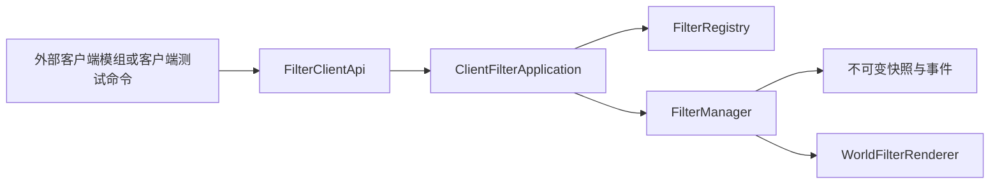

# Prismod API 使用指南

本文档是 Prismod 客户端 API、服务端 API、命令、测试入口、实现架构和网络协议的统一说明。内容对应 Minecraft 1.20.1、Forge 47.3.32、Java 17 和当前 Prismod v1 实现。

## 1. 使用边界

Prismod 只把滤镜应用到世界画面和手持物品。HUD、聊天、菜单和容器不会加入滤镜链。

### 运行环境

- Minecraft Java Edition 1.20.1；
- Minecraft Forge 47.3.32；
- Java 17；
- 客户端 API 只能在物理客户端调用；
- 服务端 API 可以在专用服务端使用，但服务端路径不能加载 `net.minecraft.client`、`Minecraft` 或 `com.xkmxz.prismod.api.client`。

### ID 与资源路径

逻辑滤镜 ID 使用完整的 `namespace:path`，例如：

```java
ResourceLocation logicalId = ResourceLocation.fromNamespaceAndPath("example", "debug");
```

`FilterClientApi.setForcedFilter`、`setSessionSelection` 和覆盖 API 接收逻辑滤镜 ID。注册 API 的 `postEffect` 是实际 PostChain JSON 资源路径，例如：

```java
ResourceLocation postEffect = ResourceLocation.fromNamespaceAndPath(
        "example", "shaders/post/debug.json");
```

这两个值用途不同，不能互换。Prismod 自定义资源包使用自己的 v1 格式，目录为 `config/prismod/resourcepacks/`，不使用 `pack.mcmeta`，也不接入 Minecraft 原版资源包管理界面。

### 公共数据约束

- 强度会规范化到 `[0.0, 1.0]`；非有限值按 `0.0` 处理。
- 客户端写操作会调度到 Minecraft 客户端线程。
- 客户端快照、滤镜描述、服务端请求和服务端结果都是不可变数据。
- API 结果使用状态和稳定反馈代码，不依赖自然语言详情。
- 外部模组只能依赖 `api` 包；`client.filter`、服务端应用层和网络实现属于内部代码。

## 2. 客户端 Java API

客户端公开入口是 `com.xkmxz.prismod.api.client.FilterClientApi`。客户端模组应直接依赖这个门面，不要依赖 `FilterManager`、`FilterRegistry`、`FilterController` 或渲染器。

### 2.1 注册自定义滤镜

最简注册形式会根据 PostChain 路径推导逻辑滤镜 ID：

```java
import com.xkmxz.prismod.api.client.FilterClientApi;
import com.xkmxz.prismod.api.client.contract.CustomFilterMetadata;
import com.xkmxz.prismod.api.client.contract.FilterRegistration;
import net.minecraft.resources.ResourceLocation;

FilterRegistration registration = FilterClientApi.registerCustomFilter(
        "example-mod",
        ResourceLocation.fromNamespaceAndPath("example", "shaders/post/debug.json"),
        new CustomFilterMetadata("filter.example.debug", 0.75F));
```

需要明确逻辑 ID 时使用重载：

```java
FilterRegistration registration = FilterClientApi.registerCustomFilter(
        ResourceLocation.fromNamespaceAndPath("example", "debug"),
        "example-mod",
        ResourceLocation.fromNamespaceAndPath("example", "shaders/post/debug.json"),
        new CustomFilterMetadata("filter.example.debug", 0.75F));
```

`ownerId` 不能为空。`CustomFilterMetadata` 的翻译键用于显示名称，默认强度会规范化到 `[0.0, 1.0]`。注册句柄提供以下状态：

```java
registration.id();
registration.ownerId();
registration.state();
registration.isActive();
registration.failureReason();
registration.failureDetail();
```

功能关闭或模组卸载时关闭句柄：

```java
registration.close();
```

关闭操作可以重复调用。批量清理某个 owner 的注册：

```java
var operation = FilterClientApi.clearRegistrations("example-mod");
operation.status();
operation.code();
operation.affectedCount();
operation.completed();
```

### 2.2 选择、强制和覆盖

强制滤镜优先于玩家总开关、F8 循环和普通选择：

```java
ResourceLocation filter = ResourceLocation.fromNamespaceAndPath("prismod", "vintage");

FilterClientApi.setForcedFilter(filter, 0.75F);
FilterClientApi.clearForcedFilter();
```

会话选择不会修改玩家配置，关闭后恢复本地选择：

```java
FilterClientApi.setSessionSelection(filter, 0.5F);
FilterClientApi.clearSessionSelection();
```

覆盖按优先级决定生效项，同一优先级使用较新的覆盖：

```java
var override = FilterClientApi.createOverride(
        "example-mod", filter, 0.8F, 100);

override.id();
override.ownerId();
override.priority();
override.state();
override.isActive();

override.close();
FilterClientApi.clearOverrides("example-mod");
```

覆盖句柄关闭后不再生效。离开世界时客户端会清理网络会话覆盖；本地 API 创建的句柄也应由调用方在功能关闭时主动关闭。

### 2.3 快照和滤镜列表

`snapshot()` 返回当前最终渲染快照：

```java
import com.xkmxz.prismod.api.client.contract.FilterSnapshot;

FilterSnapshot snapshot = FilterClientApi.snapshot();
snapshot.filter();
snapshot.strength();
snapshot.forced();
snapshot.renderAvailable();
snapshot.selectedFilter();
snapshot.selectedStrength();
snapshot.overrideOwner();
snapshot.overridePriority();
snapshot.fallbackReason();
snapshot.generation();
```

`filter()` 是最终实际滤镜，`selectedFilter()` 是用户选择。渲染资源暂时不可用时，最终滤镜可能回退为 `prismod:original`，但用户选择和回退原因仍保留。

获取完整滤镜描述或当前可用滤镜：

```java
var allFilters = FilterClientApi.filters();
var availableFilters = FilterClientApi.availableFilters();
```

`FilterDescriptor` 包含 `id`、`ownerId`、`type`、`translationKey`、`defaultStrength`、`available`、`failureReason` 和 `failureDetail`。返回列表是不可变视图。

### 2.4 状态与事件订阅

监听最终状态变化：

```java
var stateSubscription = FilterClientApi.subscribe(snapshot -> {
    System.out.println(snapshot.filter());
    System.out.println(snapshot.generation());
});

stateSubscription.close();
```

监听类型化事件：

```java
var eventSubscription = FilterClientApi.subscribeEvents(event -> {
    System.out.println(event.type());
    System.out.println(event.filters().size());
    if (event.operation() != null) {
        System.out.println(event.operation().status());
    }
});

eventSubscription.close();
```

订阅句柄是生命周期对象，关闭后停止接收事件。事件类型包括快照变化、注册表变化、可用性变化和操作完成。

### 2.5 客户端线程和优先级

以下写操作会自动调度到 Minecraft 客户端线程：

- 注册和注销自定义滤镜；
- 设置或清除强制滤镜；
- 设置或清除会话选择；
- 创建或清除覆盖。

读取 API 返回最近一次发布的不可变快照。渲染优先级为：渲染不可用时的临时原色、有效强制状态、玩家总开关与普通选择。隐藏或不可用滤镜可能回退为原色，但不会丢失用户选择。

## 3. 服务端 Java API

服务端公开入口是 `com.xkmxz.prismod.api.server.FilterServerApi`。服务端 API、服务端管理命令和服务端测试命令共享同一个 `ServerFilterApplication` 用例层。

### 3.1 请求模型

选择请求：

```java
import com.xkmxz.prismod.api.common.request.FilterSelectionRequest;
import net.minecraft.resources.ResourceLocation;

ResourceLocation filter = ResourceLocation.fromNamespaceAndPath("prismod", "original");
FilterSelectionRequest selection = new FilterSelectionRequest(filter, 1.0F);
```

覆盖请求：

```java
import com.xkmxz.prismod.api.common.request.FilterOverrideRequest;

FilterOverrideRequest override = new FilterOverrideRequest(
        "server-rule", filter, 1.0F, 100);
```

请求模型会检查滤镜不为空、owner 不为空，并规范化强度。优先级是整数，允许调用方根据业务规则决定大小。

### 3.2 查询状态

```java
var server = FilterServerApi.status();
server.initialized();
server.networkChannel();
server.protocolVersion();

var policy = FilterServerApi.filterStatus();
policy.globalSelection();
policy.globalStrength();
policy.globalOverrideCount();
policy.playerSelectionCount();
policy.playerOverrideCount();
policy.generation();
```

当前网络状态固定为 `prismod:policy` / `1`。`ServerFilterStatus` 是当前服务端保存的策略摘要，不是客户端渲染快照。

### 3.3 选择和覆盖操作

广播选择到所有客户端：

```java
var result = FilterServerApi.broadcastSelection(
        new FilterSelectionRequest(filter, 1.0F));
```

发送给单个玩家：

```java
var result = FilterServerApi.sendSelection(
        player, new FilterSelectionRequest(filter, 0.75F));
```

广播覆盖：

```java
var result = FilterServerApi.broadcastOverride(
        new FilterOverrideRequest("server-rule", filter, 1.0F, 100));
```

指定玩家覆盖：

```java
var result = FilterServerApi.sendOverride(
        player, new FilterOverrideRequest("server-rule", filter, 1.0F, 100));
```

清理策略：

```java
FilterServerApi.clearBroadcastOverride("server-rule");
FilterServerApi.clearPlayerOverride(player, "server-rule");
FilterServerApi.clearAllOverrides();
FilterServerApi.clearSelection();
```

行为规则：

- 广播选择更新全局选择，并重新发送已有的个人选择；
- 玩家选择只写入指定玩家的选择；
- 同一个 owner 的广播或玩家覆盖会更新该 owner 的服务端请求记录；
- `clearSelection()` 清理全局选择和所有个人选择；
- `clearAllOverrides()` 清理广播覆盖和玩家覆盖；
- 没有可清理对象时返回 `NOT_FOUND`；
- 服务端停止时清空全部状态并将 generation 重置为 `0`；
- API 调用不提供网络回执，返回值表示服务端用例是否接受并保存了操作。

### 3.4 OperationResult

所有写操作返回不可变的 `OperationResult`：

| 字段 | 含义 |
| --- | --- |
| `status` | `SUCCESS`、`INVALID_ARGUMENT`、`NOT_FOUND`、`FAILED` 等操作状态 |
| `code` | 稳定的 `FeedbackCode`，不包含自然语言 |
| `requestId` | 网络策略消息使用的请求 ID；失败结果使用零 UUID |
| `target` | `broadcast`、玩家 UUID 或 `all` 等目标 |
| `affectedCount` | 受影响的策略数量 |
| `parameters` | 结构化参数，当前实现可能为空 |
| `generation` | 服务端策略状态代数 |
| `accepted()` | 是否为 `SUCCESS` 的便捷判断 |

调用方应依据 `status` 和 `code` 编写逻辑，不解析命令文本或自然语言。

## 4. 服务端管理命令

### 4.1 命令树

```text
/prismod
/prismod help
/prismod status
/prismod filter select broadcast <id> [strength]
/prismod filter select player <target> <id> [strength]
/prismod filter override broadcast <owner> <id> <priority> [strength]
/prismod filter override player <target> <owner> <id> <priority> [strength]
/prismod filter clear selection
/prismod filter clear broadcast <owner>
/prismod filter clear player <target> <owner>
/prismod filter clear all
```

`filter` 下的管理操作需要 OP 权限等级 2。命令参数由 Brigadier 校验，滤镜参数使用 `namespace:path`，strength 限制在 `0.0` 到 `1.0`。

命令适配器只负责解析参数、创建公共请求模型、调用 `FilterServerApi` 和把 `OperationResult` 转换为 `Component.translatable(...)`。服务端命令不直接访问 `ServerFilterApplication` 的策略表，也不直接使用 `SimpleChannel`。

服务端命令反馈使用翻译键。成功和失败消息展示反馈代码、目标和影响数量；更完整的 request ID、generation 和参数可通过服务端 API 或 API 测试命令查看。

## 5. 客户端 API 测试命令

客户端测试命令用于模拟外部客户端模组调用公开 API：

```text
/prismod_client api help
/prismod_client api list
/prismod_client api snapshot
/prismod_client api force <filter> [strength]
/prismod_client api clear
/prismod_client api watch
/prismod_client api watch_events
/prismod_client api owner_clear
```

固定测试 owner 为：

```text
prismod-api-test-mod
```

命令作用：

| 命令 | 作用 |
| --- | --- |
| `help` | 显示客户端 API 测试入口 |
| `list` | 显示当前可用滤镜描述 |
| `snapshot` | 显示最终滤镜、强度、强制状态、渲染可用性、回退原因和 generation |
| `force` | 使用固定 owner 创建优先级 100 的覆盖；重复执行会先关闭旧句柄 |
| `clear` | 关闭当前测试覆盖句柄 |
| `watch` | 切换快照监听 |
| `watch_events` | 替换为类型化 API 事件监听 |
| `owner_clear` | 按固定 owner 清理覆盖 |

所有输出均通过客户端语言文件生成，命令代码不写入自然语言。

## 6. 服务端 API 测试命令

服务端 API 测试命令用于在实际服务器中逐项调用 `FilterServerApi`，测试人员根据客户端画面和客户端快照观察结果：

```text
/prismod_server api help
/prismod_server api status
/prismod_server api select broadcast <filter> [strength]
/prismod_server api select player <target> <filter> [strength]
/prismod_server api override broadcast <filter> <priority> [strength]
/prismod_server api override player <target> <filter> <priority> [strength]
/prismod_server api clear selection
/prismod_server api clear owner
/prismod_server api clear all
/prismod_server api reset
```

固定测试 owner 为：

```text
prismod-server-api-test
```

测试命令需要 OP 权限等级 2。`select` 调用服务端选择 API，`override` 调用服务端覆盖 API；`clear owner` 清理固定测试 owner 的广播覆盖，`clear all` 清理所有广播和玩家覆盖。

`status` 显示服务端初始化状态、协议、通道、全局选择、强度、覆盖数量、玩家选择数量、玩家覆盖数量和 generation。每个写操作显示 `OperationResult` 的状态、反馈代码、request ID、目标、影响数量、generation 和参数。`reset` 依次调用 `clearSelection()` 与 `clearAllOverrides()`，适合测试前后清理状态。

### 推荐测试流程

1. 使用 `/prismod_server api reset` 清理已有策略。
2. 使用 `/prismod_server api status` 记录初始 generation 和计数。
3. 执行 `select broadcast`，在客户端使用 `/prismod_client api snapshot` 检查会话选择。
4. 执行两次 `override broadcast`，改变 strength 或 priority，检查服务端计数和客户端快照。
5. 使用 `select player` 和 `override player` 检查指定玩家路径。
6. 对比 `status` 中的 generation、全局覆盖数和玩家覆盖数。
7. 使用 `clear owner`、`clear selection` 和 `clear all` 验证清理结果。
8. 使用客户端 `watch` 或 `watch_events` 观察状态发布。

## 7. API 实现架构

### 7.1 客户端数据流



- `FilterClientApi` 是稳定公开门面；
- `ClientFilterApplication` 执行参数检查、owner 归一化、客户端线程调度和操作状态发布；
- `FilterRegistry` 管理滤镜发现、注册和描述；
- `FilterManager` 保存选择、强制状态、覆盖和渲染可用性；
- 快照和事件只通过公开 API 契约发布；
- 渲染器只消费内部状态，不属于公开 API。

### 7.2 服务端数据流

```mermaid
flowchart LR
    A[服务端模组]
    B[FilterServerApi]
    C[/prismod 管理命令]
    D[/prismod_server api 测试命令]
    E[ServerFilterApplication]
    F[PolicyTransport]
    G[PolicyNetwork]
    H[客户端网络接收适配器]
    I[FilterClientApi]

    A --> B --> E
    C --> B
    D --> B
    E --> F --> G --> H --> I
```

- API 和两类命令使用相同的服务端用例层；
- `ServerFilterApplication` 保存策略状态、generation、广播/玩家选择和覆盖记录；
- `PolicyTransport` 是服务端业务可见的冻结端口；
- `PolicyNetwork` 封装 Forge 网络实现；
- 客户端接收消息后只能调用 `FilterClientApi`，不会直接操作服务端状态。

## 8. 冻结网络架构

### 8.1 通道和传输端口

| 项目 | 固定值 |
| --- | --- |
| 通道 | `prismod:policy` |
| 协议版本 | `1` |
| 业务端口 | `PolicyTransport` |
| Forge 实现 | `PolicyNetwork` |
| 业务消息 | 不可变 `PolicyMessage` |

`SimpleChannel`、`PacketDistributor`、`FriendlyByteBuf` 编解码和 Forge `NetworkEvent` 只存在于网络实现内部。服务端应用层不直接依赖这些实现类型。

### 8.2 PolicyMessage

消息字段固定为：

| 字段 | 含义 |
| --- | --- |
| `operation` | 策略操作枚举 |
| `requestId` | 策略请求和幂等标识 |
| `owner` | 覆盖所属 owner；选择和清理选择时为空 |
| `filter` | 逻辑滤镜 ID；清理操作时可以为空 |
| `strength` | 滤镜强度 |
| `priority` | 覆盖优先级 |

操作枚举固定为：

```text
SELECT
OVERRIDE
CLEAR_SELECTION
CLEAR_OVERRIDE
CLEAR_ALL_OVERRIDES
```

广播和指定玩家是 `PolicyTransport.broadcast(...)` 与 `send(...)` 的传输目标，不写入 `PolicyMessage` 字段。

### 8.3 发送、接收和登录补发

服务端通过 `PolicyTransport` 发送策略：

- 广播选择和广播覆盖发送给所有客户端；
- 玩家选择和玩家覆盖发送给指定玩家；
- 登录时补发当前全局选择、全局覆盖、个人选择和个人覆盖；
- 网络首版不提供状态查询、通用 RPC 或操作回执。

客户端 `PrismodClientNetwork` 的接收规则：

- `SELECT` 调用 `FilterClientApi.setSessionSelection`；
- `OVERRIDE` 调用 `FilterClientApi.createOverride`；
- `CLEAR_SELECTION` 调用 `FilterClientApi.clearSessionSelection`；
- `CLEAR_OVERRIDE` 关闭对应 request ID 的客户端覆盖句柄；
- `CLEAR_ALL_OVERRIDES` 关闭并清空全部网络覆盖句柄；
- 重复的覆盖 request ID 被忽略，以保证幂等；
- 客户端退出世界时清理网络策略会话。

同一个 owner 的服务端覆盖会更新服务端记录。若需要在客户端明确观察覆盖替换，建议先执行对应清理命令，再创建新覆盖，以便产生新的客户端策略生命周期。

## 9. 常见问题

### 逻辑 ID 和 PostChain 路径混用

`prismod:vintage` 是逻辑滤镜 ID；`example:shaders/post/debug.json` 是注册 API 的 PostChain 路径。选择、强制和覆盖使用前者，注册自定义 PostChain 使用后者。

### strength 超出范围

请求和元数据会把有限值限制在 `[0.0, 1.0]`，NaN 和无穷值按 `0.0` 处理。命令参数本身也限制在 `0.0` 到 `1.0`。

### 服务端调用成功但画面没有变化

服务端 API 的返回值表示服务端是否接受并保存策略，不是客户端渲染回执。请确认客户端安装了 Prismod、滤镜资源可用，并通过 `/prismod_client api snapshot` 检查实际客户端状态。

### 权限不足

`/prismod filter ...` 和 `/prismod_server api ...` 需要 OP 权限等级 2。客户端测试命令不使用服务端 OP 权限。

### 滤镜不可用或回退原色

资源缺失、PostChain 校验失败、GL 资源上传失败或渲染链不可用时，客户端会回退原色并保留回退原因。先使用 `list`、`snapshot` 或资源包管理页确认滤镜是否可用。

### 网络版本不匹配

服务端和客户端必须使用 `prismod:policy` / `1`。网络层不保留旧通道、旧协议或兼容协商入口。

## 10. 相关文档

- [`docs/Java_API_调用说明.md`](Java_API_调用说明.md)：客户端 API 的专题调用说明。
- [`docs/服务端_API_与命令.md`](服务端_API_与命令.md)：服务端 API、管理命令和冻结网络协议的专题说明。
- [`docs/自定义滤镜资源包制作说明.md`](自定义滤镜资源包制作说明.md)：Prismod v1 自定义资源包、PostChain、LUT 和调试 uniform。
- [`PRISMOD_GUIDE_PROMPT.md`](../PRISMOD_GUIDE_PROMPT.md)：项目边界、架构和开发约定。
